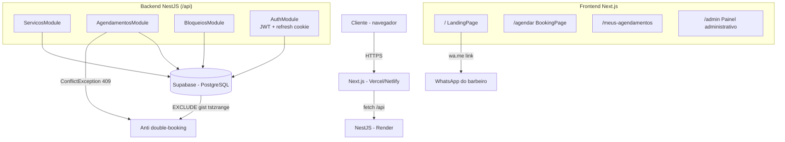

# 💈 BarberApp V1

<p align="center">
  
  
  
  
  
</p>

Sistema web responsivo para automatizar o agendamento de atendimentos de uma barbearia. Clientes consultam a agenda e fazem reservas em poucos cliques — sem WhatsApp manual e sem criar conta — enquanto o barbeiro gerencia a agenda diária, serviços e bloqueios de horário por um painel administrativo.

---

## Funcionalidades

### Cliente (público)

- **Fluxo de agendamento em 4 passos** com UX mobile-first:
  1. **Escolha o dia** — calendário mensal em grade (7 colunas), navegação entre meses, dias passados desabilitados.
  2. **Escolha o serviço** — cards com preço (R$) e duração.
  3. **Escolha o horário** — grade de slots do expediente em horário local; ocupados ficam esmaecidos/riscados e desabilitados (não somem).
  4. **Seus dados** — somente Nome + WhatsApp (com validação regex).
- **Confirmação via WhatsApp** — link `wa.me` gerado com mensagem pré-formatada com os dados do atendimento.
- **Consulta "Meus agendamentos"** — o cliente informa o celular e vê os próprios horários e status.
- **Bloqueios refletidos em tempo real** — almoço, folga e imprevistos desaparecem dos horários disponíveis.

### Barbeiro (admin)

- **Login seguro** — JWT + refresh token em cookie httpOnly (revogado no logout ou ao expirar), com rate limit no login e suporte a múltiplos admins.
- **Painel com 3 abas:** Agenda · Serviços · Disponibilidade.
- **Dashboard** — cards com total / confirmados / concluídos / cancelados.
- **Agenda do dia** — lista cronológica com status, cliente, serviço e WhatsApp; filtros por status e por serviço.
- **Alteração de status** — marcar como `CONCLUIDO` ou `CANCELADO`.
- **CRUD de serviços** — criar, editar (inline), ativar/desativar e excluir (com modal de confirmação).
- **Bloqueios tipados e recorrentes**:
  - **Almoço** (intervalo fixo diário, ex.: 12h–13h, por dia da semana);
  - **Folga** (dia inteiro, pontual ou recorrente);
  - **Imprevisto** (período pontual).

### Técnica

- **Anti double-booking** — constraint `EXCLUDE USING gist (tstzrange ...)` no PostgreSQL para `agendamentos` e `bloqueios`, validada novamente no backend (409 com `ConflictException`).
- **Fuso horário unificado** — `America/Sao_Paulo` em utilitários compartilhados; grade calculada em horário local (sem bugs de UTC).
- **Logs** estruturados (`Logger` do Nest) nos fluxos de agendamentos e bloqueios.
- **Validação de input** por regex em todos os campos do frontend (telefone, nome, preço, duração).
- **Responsividade mobile** completa (devtools 320px+): zero scroll horizontal, grades e flexes adaptados.

---

## Arquitetura



---

## Stack

| Tecnologia | Função |
|-----------|--------|
| **NestJS 11** | Backend API REST (módulos, guards, validation pipes) |
| **TypeScript 5** | Tipagem em todo o projeto (backend e frontend) |
| **Supabase (PostgreSQL)** | Banco de dados, RLS, constraints anti-overlap |
| **Next.js 16 (App Router)** | Frontend (SSR/CSR) |
| **Tailwind CSS 4** | Estilização e responsividade |
| **date-fns-tz** | Conversão e cálculo de fuso horário |
| **bcryptjs + jsonwebtoken** | Senha de admin e tokens JWT |
| **Jest** | Testes unitários do backend |

---

## Estrutura do Projeto

```
BarberApp/
├── backend-barber/            # API NestJS
│   ├── src/
│   │   ├── main.ts            # Bootstrap, CORS, prefixo /api, ValidationPipe
│   │   ├── app.module.ts
│   │   ├── agendamentos/      # Controller + service + DTOs + testes
│   │   ├── servicos/          # CRUD de serviços
│   │   ├── bloqueios/         # Bloqueios tipados e recorrentes + testes
│   │   ├── auth/              # Login, JWT, guards, refresh token
│   │   ├── supabase/          # Provider Supabase
│   │   ├── types/database.ts  # Tipos das linhas do banco
│   │   └── horario.{config,util}.ts  # Fuso America/Sao_Paulo
│   ├── scripts/criar-admin.mjs
│   └── .env.example
├── frontend/                  # Next.js App Router
│   └── src/
│       ├── app/               # page.tsx, agendar, admin, meus-agendamentos
│       ├── components/        # LandingPage, BookingPage, AdminPage, ...
│       └── lib/               # api.ts, horario.ts
│       └── .env.example
└── supabase/schema.sql        # DDL idempotente (tabelas, RLS, constraints)
```

---

## API

> Todos os endpoints com prefixo `/api`. Rotas de admin exigem `Authorization: Bearer <access_token>`.

### Públicas

| Método | Rota | Descrição |
|--------|------|-----------|
| `GET` | `/api/servicos` | Lista serviços ativos (nome, preço, duração) |
| `GET` | `/api/agendamentos/disponiveis?servicoId=&data=` | Slots do expediente com disponibilidade |
| `GET` | `/api/agendamentos/meus?whatsapp=` | Agendamentos de um celular |
| `POST` | `/api/agendamentos` | Cria agendamento (retorna 409 se conflitar) |

### Autenticação

| Método | Rota | Descrição |
|--------|------|-----------|
| `POST` | `/api/auth/login` | Login (usuário/senha) → `access_token` + cookie refresh (rate limited) |
| `POST` | `/api/auth/refresh` | Renova access token sem rotacionar o refresh token |
| `POST` | `/api/auth/logout` | Revoga sessão e limpa cookie |
| `GET` | `/api/auth/me` | Info do usuário autenticado |

### Admin (protegidas)

| Método | Rota | Descrição |
|--------|------|-----------|
| `GET` | `/api/agendamentos?data=` | Agenda do dia |
| `PATCH` | `/api/agendamentos/:id/status` | Altera status (CONCLUIDO/CANCELADO) |
| `GET` | `/api/servicos/todos` | Todos os serviços (inclui inativos) |
| `POST` | `/api/servicos` | Cria serviço |
| `PATCH` | `/api/servicos/:id` | Atualiza serviço (nome/preço/duração/ativo) |
| `DELETE` | `/api/servicos/:id` | Remove serviço (204) |
| `POST` | `/api/bloqueios` | Cria bloqueio (409 se sobrepuser) |
| `GET` | `/api/bloqueios` | Lista bloqueios |
| `DELETE` | `/api/bloqueios/:id` | Remove bloqueio (204) |

---

## Instalação

### Pré-requisitos

- Node.js 20+
- Projeto no [Supabase](https://supabase.com) (PostgreSQL)

### 1. Banco de dados

Rode o `supabase/schema.sql` no **SQL Editor** do Supabase. O script é idempotente (cria tabelas, índices, constraints anti-overlap, RLS e seed de serviços).

### 2. Backend

```bash
cd backend-barber
npm install
cp .env.example .env    # preencha SUPABASE_URL, SUPABASE_ANON_KEY, SUPABASE_SERVICE_KEY
npm run criar-admin -- meu_usuario "sua-senha"
npm run start:dev       # http://localhost:3000
```

### 3. Frontend

```bash
cd frontend
npm install
cp .env.example .env.local   # preencha NEXT_PUBLIC_API_URL e NEXT_PUBLIC_BARBER_WHATSAPP
npm run dev                  # http://localhost:3001
```

---

## Configuração (.env)

### Backend (`backend-barber/.env`)

| Variável | Obrigatório | Descrição |
|----------|------------|-----------|
| `PORT` | Não | Porta (padrão 3000; plataforma de deploy define) |
| `SUPABASE_URL` | Sim | URL do projeto Supabase |
| `SUPABASE_ANON_KEY` | Sim | Chave pública (anon/publishable) |
| `SUPABASE_SERVICE_KEY` | Sim* | Chave `service_role` (ignora RLS — necessária para login do admin) |

### Frontend (`frontend/.env.local`)

| Variável | Obrigatório | Descrição |
|----------|------------|-----------|
| `NEXT_PUBLIC_API_URL` | Sim | URL do backend + `/api` (ex.: `http://localhost:3000/api`) |
| `NEXT_PUBLIC_BARBER_WHATSAPP` | Sim | WhatsApp do barbeiro, só dígitos com DDI/DDD (ex.: `5535999999999`) |

---

## Testes

**25 testes — 4 suítes — Jest** (backend)

| Comando | Descrição |
|---------|-----------|
| `npm test` | Roda todos os testes (dentro de `backend-barber`) |
| `npm run test:watch` | Modo watch |
| `npm run test:cov` | Cobertura |

> Os testes cobrem agendamentos (geração de slots, conflitos), autenticação (login/refresh) e bloqueios (recorrentes ancorados por dia, conflito → 409, e mapeamento do erro `23P01`).

---

## Deploy

### Backend — Render

- Novo **Web Service**; root dir `backend-barber`
- Build: `npm run build` · Start: `node dist/main.js`
- Variáveis: `SUPABASE_URL`, `SUPABASE_ANON_KEY`, `SUPABASE_SERVICE_KEY`

### Frontend — Vercel (ou Netlify)

- Root dir `frontend` (Next.js detectado automaticamente)
- Variáveis: `NEXT_PUBLIC_API_URL` (URL do backend deployado) e `NEXT_PUBLIC_BARBER_WHATSAPP`

**Fluxo:** deploy do backend → rodar `schema.sql` em produção → criar admin → deploy do frontend apontando para a URL do backend.

---

## Licença

MIT