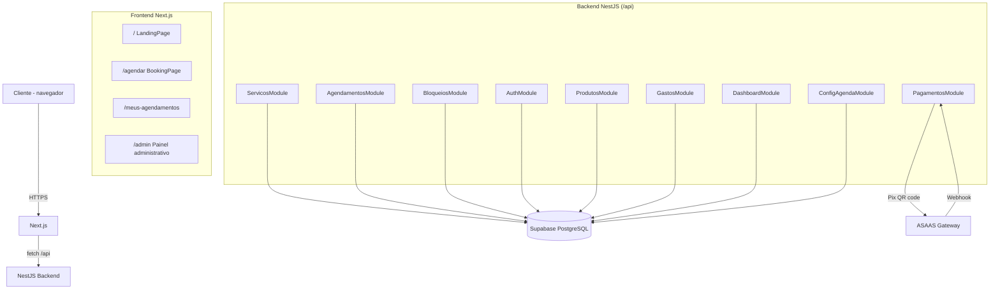

# MakeupApp

<p align="center">
  
  
  
  
  
  
</p>

Sistema web responsivo para automatizar o agendamento de atendimentos de um salão de beleza. Clientes consultam a agenda, escolhem serviços e pagam o sinal via Pix em poucos cliques — sem WhatsApp manual e sem criar conta — enquanto a profissional gerencia a agenda, estoque e finanças por um painel administrativo.

---

## Funcionalidades

### Cliente (público)

- **Fluxo de agendamento em 4 passos** com UX mobile-first:
  1. **Escolha o dia** — calendário mensal em grade (7 colunas), navegação entre meses, dias passados e dias sem expediente desabilitados.
  2. **Escolha o serviço** — cards com preço (R$), duração e categoria.
  3. **Escolha o horário** — grade de slots do expediente em horário local; ocupados ficam esmaecidos e desabilitados.
  4. **Seus dados** — Nome + WhatsApp (com validação regex).
- **Pagamento do sinal via Pix** — geração automática de QR code (50% do valor), com expiração de 15 minutos e confirmação via webhook do ASAAS.
- **Confirmação via WhatsApp** — link `wa.me` gerado com mensagem pré-formatada.
- **Consulta "Meus agendamentos"** — o cliente informa o celular e vê os próprios horários e status.

### Profissional (admin)

- **Login seguro** — JWT + refresh token em cookie httpOnly, rate limit no login e suporte a múltiplos admins.
- **Dashboard** — gráfico de linhas (compras vs. consumo vs. extras), métricas de agendamentos, filtros por período (3/6/12 meses).
- **Painel com 4 abas:** Agenda · Serviços · Expediente · Estoque.
- **Agenda do dia** — lista cronológica com status, cliente, serviço e WhatsApp; filtros por status e serviço.
- **Alteração de status** — marcar como `CONCLUIDO` ou `CANCELADO`.
- **CRUD de serviços** — criar, editar, ativar/desativar e excluir (com validação de nome único).
- **Expediente configurável** — toggle por dia da semana com horários de início/fim; o calendário do cliente respeita automaticamente.
- **Bloqueios tipados e recorrentes** — Almoço, Folga e Imprevisto.
- **Gestão de estoque** — cadastro de produtos, registro de compras por lote, encerramento de lotes (usados/perdidos/expirados), cálculo de custo por pessoa atendida.
- **Gastos gerais** — registro de despesas por categoria (Curso, Ferramenta, Transporte, Outro).

### Técnica

- **Anti double-booking** — constraint `EXCLUDE USING gist (tstzrange ...)` no PostgreSQL para `agendamentos` e `bloqueios`.
- **Anti double-charge** — claim mechanism (`gateway_payment_id = 'creating'`) com rollback automático; `gravarPix` com `.is('pix_qr_base64', null)` para garantir idempotência.
- **Fuso horário unificado** — `America/Sao_Paulo` em utilitários compartilhados.
- **Gateway ASAAS** — criação de customer + pagamento PIX + QR code com timeout de 15s e logging por etapa.
- **Webhooks** — processamento assíncrono de confirmação de pagamento com validação de token.
- **Testes** — 48 testes unitários (Jest) cobrindo agendamentos, pagamentos, produtos, gastos, dashboard, bloqueios, auth e serviços.

---

## Arquitetura



---

## Stack

| Tecnologia | Função |
|-----------|--------|
| **NestJS 11** | Backend API REST (módulos, guards, validation pipes) |
| **TypeScript 5** | Tipagem em todo o projeto |
| **Supabase (PostgreSQL)** | Banco de dados, RLS, constraints anti-overlap |
| **Next.js 16 (App Router)** | Frontend SSR/CSR |
| **Tailwind CSS 4** | Estilização e responsividade |
| **ASAAS** | Gateway de pagamento Pix (sandbox + produção) |
| **date-fns-tz** | Conversão de fuso horário |
| **bcryptjs + jsonwebtoken** | Senha hash e tokens JWT |
| **Jest** | Testes unitários (48 testes) |

---

## Estrutura do Projeto

```
MakeupApp/
├── backend-makeup/            # API NestJS
│   ├── src/
│   │   ├── main.ts            # Bootstrap, CORS, prefixo /api, ValidationPipe
│   │   ├── app.module.ts
│   │   ├── agendamentos/      # Controller + service + DTOs + testes
│   │   ├── servicos/          # CRUD de serviços
│   │   ├── bloqueios/         # Bloqueios tipados e recorrentes
│   │   ├── pagamentos/        # Pix via ASAAS (gateway + webhook + claim)
│   │   ├── auth/              # Login, JWT, guards, refresh token
│   │   ├── produtos/          # Estoque: produtos, compras, encerramentos
│   │   ├── gastos/            # Despesas gerais
│   │   ├── dashboard/         # Métricas e gráficos
│   │   ├── config-agenda/     # Expediente por dia da semana
│   │   ├── supabase/          # Provider Supabase
│   │   ├── makeup.config.ts   # Constantes (fuso horário, etc.)
│   │   └── types/database.ts  # Tipos gerados do banco
│   ├── scripts/criar-admin.mjs
│   ├── .env.example
│   └── package.json
├── frontend/                  # Next.js App Router
│   └── src/
│       ├── app/               # page.tsx, agendar, admin, meus-agendamentos
│       ├── components/        # BookingPage, AdminPage, PixSinal, DashboardAdmin, ...
│       └── lib/               # api.ts, horario.ts
├── supabase/
│   ├── schema.sql             # DDL idempotente (10 tabelas, RLS, constraints)
│   ├── seed.sql               # Dados de teste idempotentes
│   └── cleanup.sql            # Remove dados de teste, restaura defaults
├── Context.md
└── PLANO.md
```

---

## API

> Todos os endpoints com prefixo `/api`. Rotas de admin exigem `Authorization: Bearer <access_token>`.

### Públicas

| Método | Rota | Descrição |
|--------|------|-----------|
| `GET` | `/api/servicos` | Lista serviços ativos |
| `GET` | `/api/agendamentos/disponiveis?servicoId=&data=` | Slots do expediente com disponibilidade |
| `GET` | `/api/agendamentos/meus?whatsapp=` | Agendamentos de um celular |
| `POST` | `/api/agendamentos` | Cria agendamento (retorna 409 se conflitar) |
| `GET` | `/api/config-agenda` | Configuração de expediente (horários por dia) |

### Pagamento (Pix)

| Método | Rota | Descrição |
|--------|------|-----------|
| `POST` | `/api/agendamentos/:id/pix` | Gera QR code Pix (50% do valor) |
| `GET` | `/api/agendamentos/:id/pix` | Retorna dados Pix existentes |
| `GET` | `/api/agendamentos/:id/sinal-status` | Poll de status do pagamento |
| `POST` | `/api/agendamentos/:id/cancelar-sinal` | Cancela sinal pendente (admin) |
| `POST` | `/api/pagamentos/webhook/asaas` | Webhook de confirmação ASAAS |

### Autenticação

| Método | Rota | Descrição |
|--------|------|-----------|
| `POST` | `/api/auth/login` | Login → access_token + cookie refresh |
| `POST` | `/api/auth/refresh` | Renova access token |
| `POST` | `/api/auth/logout` | Revoga sessão |
| `GET` | `/api/auth/me` | Info do usuário autenticado |

### Admin (protegidas)

| Método | Rota | Descrição |
|--------|------|-----------|
| `GET` | `/api/agendamentos?data=` | Agenda do dia |
| `PATCH` | `/api/agendamentos/:id/status` | Altera status |
| `GET` | `/api/servicos/todos` | Todos os serviços (inclui inativos) |
| `POST` | `/api/servicos` | Cria serviço |
| `PATCH` | `/api/servicos/:id` | Atualiza serviço |
| `DELETE` | `/api/servicos/:id` | Remove serviço |
| `POST` | `/api/bloqueios` | Cria bloqueio |
| `GET` | `/api/bloqueios` | Lista bloqueios |
| `DELETE` | `/api/bloqueios/:id` | Remove bloqueio |
| `PUT` | `/api/config-agenda` | Atualiza expediente |
| `GET` | `/api/produtos` | Lista produtos com resumo de custos |
| `POST` | `/api/produtos` | Cria produto |
| `PATCH` | `/api/produtos/:id` | Atualiza produto |
| `DELETE` | `/api/produtos/:id` | Remove produto |
| `GET` | `/api/compras` | Lista compras |
| `POST` | `/api/compras` | Registra compra |
| `PATCH` | `/api/compras/:id` | Atualiza compra |
| `DELETE` | `/api/compras/:id` | Remove compra |
| `POST` | `/api/compras/:id/encerrar` | Encerra lote (usado/perdido/expirado) |
| `GET` | `/api/gastos` | Lista gastos |
| `POST` | `/api/gastos` | Registra gasto |
| `PATCH` | `/api/gastos/:id` | Atualiza gasto |
| `DELETE` | `/api/gastos/:id` | Remove gasto |
| `GET` | `/api/dashboard` | Métricas e dados para gráficos |

---

## Instalação

### Pré-requisitos

- Node.js 24+ (necessário para `@supabase/supabase-js` v2 com WebSocket nativo)
- Projeto no [Supabase](https://supabase.com) (PostgreSQL)
- Conta no [ASAAS](https://www.asaas.com) (sandbox para desenvolvimento)

### 1. Banco de dados

Rode o `supabase/schema.sql` no **SQL Editor** do Supabase. Opcionalmente, rode `supabase/seed.sql` para dados de teste.

### 2. Backend

```bash
cd backend-makeup
npm install
cp .env.example .env    # preencha todas as variáveis
npm run criar-admin -- meu_usuario "sua-senha"
npm run start:dev       # http://localhost:3000
```

### 3. Frontend

```bash
cd frontend
npm install
cp .env.example .env.local   # preencha NEXT_PUBLIC_API_URL e NEXT_PUBLIC_SHOP_WHATSAPP
npm run dev                  # http://localhost:3001
```

---

## Configuração (.env)

### Backend (`backend-makeup/.env`)

| Variável | Obrigatório | Descrição |
|----------|------------|-----------|
| `PORT` | Não | Porta (padrão 3000) |
| `SUPABASE_URL` | Sim | URL do projeto Supabase |
| `SUPABASE_ANON_KEY` | Sim | Chave pública (anon) |
| `SUPABASE_SERVICE_KEY` | Sim | Chave `service_role` (ignora RLS) |
| `JWT_SECRET` | Sim | Secret para tokens JWT (`openssl rand -hex 32`) |
| `ADMIN_KEY` | Sim | Chave para criação de admin via script |
| `SINAL_PERCENTUAL` | Não | Percentual do sinal (padrão 0.5 = 50%) |
| `SINAL_TTL_MINUTOS` | Não | Minutos até expirar o Pix (padrão 15) |
| `GATEWAY_PRIMARY` | Sim | `asaas` (homologação) |
| `ASSAAS_API_URL` | Sim | `https://api-sandbox.asaas.com` (dev) ou `https://api.asaas.com` (prod) |
| `ASSAAS_API_KEY` | Sim | Chave de API do ASAAS |
| `ASSAAS_WEBHOOK_TOKEN` | Sim | Token para validar webhooks do ASAAS |

### Frontend (`frontend/.env.local`)

| Variável | Obrigatório | Descrição |
|----------|------------|-----------|
| `NEXT_PUBLIC_API_URL` | Sim | URL do backend + `/api` |
| `NEXT_PUBLIC_SHOP_WHATSAPP` | Sim | WhatsApp do estúdio (só dígitos, DDI+DDD) |
| `NEXT_PUBLIC_SHOP_NAME` | Não | Nome do estúdio (padrão: MakeupApp Studio) |
| `NEXT_PUBLIC_SHOP_TAGLINE` | Não | Tagline exibida na home |

---

## Testes

**48 testes — 8 suítes — Jest** (backend)

| Comando | Descrição |
|---------|-----------|
| `npm test` | Roda todos os testes |
| `npm run test:watch` | Modo watch |
| `npm run test:cov` | Cobertura |

> Cobertura: agendamentos (slots, conflitos, sinais expirados), pagamentos (geração Pix, webhooks, cancelamento), produtos (compras, encerramentos), gastos, dashboard, bloqueios (recorrência, conflitos), auth (login, refresh, JWT) e serviços.

---

## Deploy

### Backend — Render

- **Web Service**; root dir `backend-makeup`
- Build: `npm run build` · Start: `node dist/main.js`
- Variáveis: todas as do `.env` (incluindo ASAAS)

### Frontend — Vercel

- Root dir `frontend` (Next.js detectado automaticamente)
- Variáveis: `NEXT_PUBLIC_API_URL`, `NEXT_PUBLIC_SHOP_WHATSAPP`, `NEXT_PUBLIC_SHOP_NAME`

**Fluxo:** deploy backend → rodar `schema.sql` em produção → criar admin → configurar ASAAS (produção) → deploy frontend.

---

## Licença

MIT
